# 🏥 HIPAA Medical Smart Agent (MCP-based CLI Demo)

## Overview
This project is an intermediate-level demonstration of a secure, HIPAA-conscious medical NLP system built using the MCP (Model Context Protocol) framework. It showcases role-based access control with local LLM inference (LLaMA3.2 via Ollama) and integrated X-ray analysis using torchxrayvision.

## 🧠 System Architecture Diagram

```mermaid
flowchart TD
  subgraph User
    D(Doctor)
    A(Admin)
  end

  subgraph CLI_Client["🖥️ CLI Client"]
    InputProcessor[input_processor.py]
    UIHandler[ui_handler.py]
    HipaaClient[hipaa_client.py]
  end

  subgraph Server["🧠 MCP Server"]
    ServerMain[server.py]
    
    subgraph Tools["🛠️ MCP Tools"]
      PatientTool[patient_info_tool.py]
      XrayTool[xray_analysis_tool.py]
      ChatTool[chat_tool.py]
    end

    subgraph Compliance["🔐 HIPAA Compliance"]
      Logger[hipaa_logger.py]
      Masker[hipaa_compliance.py]
    end

    subgraph Models["📊 Models"]
      ModelMgr[model_manager.py]
    end

    subgraph Utils["⚙️ Utils"]
      DataLoader[data_loader.py]
      LLaMAClient[llama_client.py]
    end
  end

  subgraph EHR["📁 EHR + X-ray"]
    JSONs[JSON Records]
    XRays[X-ray PNGs]
  end

  subgraph Logs["🗂️ Logs"]
    Audit[audit.log]
    Prompt[prompt.log]
    Violations[violations.log]
  end

  %% User flow
  D -->|Role = Doctor| HipaaClient
  A -->|Role = Admin| HipaaClient

  %% Client interactions
  HipaaClient --> UIHandler
  HipaaClient --> InputProcessor
  HipaaClient -->|Request| ServerMain

  %% Server logic
  ServerMain --> Tools
  ServerMain --> Compliance
  ServerMain --> Models
  ServerMain --> Utils

  %% Tool usage
  PatientTool -->|Fetch| JSONs
  XrayTool -->|Analyze| XRays
  ChatTool -->|Query| LLaMAClient

  %% Compliance layer
  ServerMain --> Masker
  ServerMain --> Logger

  Masker -->|Mask PHI| PatientTool
  Masker -->|Mask PHI| ChatTool
  Logger --> Audit
  Logger --> Prompt
  Logger --> Violations

  %% Model interaction
  ModelMgr --> XrayTool
  ModelMgr --> ChatTool

  DataLoader --> PatientTool
  DataLoader --> XrayTool

  %% Logging output
  ServerMain --> Logs
```



The demo reflects a realistic healthcare workflow, enforcing PHI (Protected Health Information) redaction and comprehensive logging for doctors while allowing administrators unrestricted access—all without relying on expensive cloud APIs.

<p align="center">
  
  
</p>


## Roles Supported
- **Doctor** – HIPAA restrictions enabled: PHI masking, data filtering, strict audit logging
- **Administrator** – HIPAA restrictions disabled: full access to patient data including PII

## ⚙️ Key Features
- **Conversational CLI Interface** with LLaMA3.2 local inference
- **PHI Filtering & Data Masking** (SSN, Address, Phone, Email, etc.) for doctor role
- **TorchXRayVision Integration** for X-ray-based disease prediction with HIPAA compliance
- **Role-based Access Control** with different permission levels
- **Comprehensive Audit System** with three log types: audit, prompt, and violation logs
- **Real-time Interactive Experience** - no simulations, fully functional MCP system
- **Local-only Processing** - no cloud APIs or external dependencies

## Directory Structure
```
project/
├── client.py                           # CLI client entry point
├── server.py                           # MCP server with all tools and resources
├── .env                                # LLaMA3 model configs and API keys
├── ehr/                                # Patient health records (JSON format)
│   ├── Patient_1.json
│   ├── Patient_2.json
│   └── Patient_3.json
├── normalized_patients/                # X-ray image files (preprocessed)
│   ├── Patient_1.png
│   ├── Patient_2.png
│   └── Patient_3.png
├── logs/                               # HIPAA compliance logs
│   ├── audit.log                       # Tool usage and access events
│   ├── prompt.log                      # Complete conversation history
│   └── violations.log                  # HIPAA violation attempts
├── src/
│   ├── client/
│   │   ├── hipaa_client.py             # Main client-side logic
│   │   ├── ui_handler.py               # CLI display and interaction
│   │   └── input_processor.py          # Input sanitization and preprocessing
│   └── server/
│       ├── hipaa_server.py             # Main MCP server runtime
│       ├── models/
│       │   └── model_manager.py        # TorchXRayVision + LLaMA model management
│       ├── tools/
│       │   ├── base_tool.py            # Base tool class for MCP
│       │   ├── tool_registry.py        # MCP tool plugin registry
│       │   ├── patient_info_tool.py    # EHR data retrieval tool
│       │   ├── xray_analysis_tool.py   # TorchXRayVision analysis tool
│       │   └── chat_tool.py            # LLaMA3.2 conversation tool
│       ├── utils/
│       │   ├── data_loader.py          # EHR and image I/O utilities
│       │   └── llama_client.py         # Ollama LLaMA3.2 interface
│       └── compliance/
│           ├── hipaa_logger.py         # Multi-type logging system
│           └── hipaa_compliance.py     # Data masking and policy enforcement
```

## 🚀 Quick Start

### Prerequisites
- Python 3.8+
- Ollama with `llama3.2:latest` model installed and running
- Required Python packages (see requirements below)

### Installation & Setup
1. **Start Ollama with LLaMA3.2:**
   ```bash
   ollama serve
   ollama pull llama3.2:latest
   ```

2. **Start the MCP Server:**
   ```bash
   python server.py
   ```

3. **Launch the Client:**
   ```bash
   python client.py
   ```

4. **Choose Your Role:**
   ```
   Choose your role (doctor/administrator): doctor
   ```

### Example Interactions

**Doctor Session (HIPAA Enabled):**
```
Agent: Hi Doctor, let's get to know about your patients.
Doctor: Can you give me notes on Patient 1?
Agent: The notes related to Patient 1 suggest that the patient has hypertension and diabetes. 
       Contact information and SSN are restricted per HIPAA compliance.
Doctor: Can you analyze the X-ray for Patient 1?
Agent: Based on the X-ray analysis, I've detected potential signs of cardiomegaly (confidence: 62.2%).
       Full patient identifiers are masked for privacy.
Doctor: quit
```

**Administrator Session (No HIPAA Restrictions):**
```
Agent: Hi Admin, let's get to know about your patients.
Admin: Can you give me notes on Patient 1?
Agent: Patient John Smith (SSN: 123-45-6789) at 123 Main St, Buffalo, NY has hypertension 
       and Type 2 diabetes. Phone: (716) 555-0123...
Admin: quit
```

## Technical Implementation

### HIPAA Compliance Engine
- **Data Masking**: Automatic redaction of SSN, addresses, phone numbers, emails
- **Role-based Filtering**: Different data access levels based on user role
- **Real-time Validation**: Input pattern detection to prevent HIPAA violations
- **Audit Trail**: Complete logging of all access attempts and data interactions

### X-Ray Analysis Integration
```python
# TorchXRayVision workflow integrated into MCP tools
model = xrv.models.DenseNet(weights="densenet121-res224-all")
outputs = model(processed_image)
results = dict(zip(model.pathologies, outputs[0].detach().numpy()))
```

Disease predictions include:
- Atelectasis, Cardiomegaly, Consolidation, Edema
- Effusion, Emphysema, Fibrosis, Fracture
- Pneumonia, Pneumothorax, and more

### Sample Patient Data Structure
```json
{
  "patient_id": "001",
  "name": "John Smith",
  "age": 45,
  "ssn": "123-45-6789",
  "address": "123 Main St, Buffalo, NY 14201",
  "phone": "(716) 555-0123",
  "medical_conditions": ["Hypertension", "Type 2 Diabetes"],
  "current_medications": ["Lisinopril 10mg daily", "Metformin 500mg twice daily"],
  "vital_signs": {
    "blood_pressure": "145/92",
    "heart_rate": "78"
  },
  "lab_results": {
    "hba1c": "8.2%",
    "glucose": "165 mg/dL"
  }
}
```

## Logging System

### Three-tier Logging:
1. **audit.log** - All tool usage, access events, and system interactions
2. **prompt.log** - Complete conversation history with timestamps
3. **violations.log** - Detected HIPAA violation attempts and blocked requests

## Extension Points

| Component | Extension Path |
|-----------|----------------|
|  **MCP Tools** | `src/server/tools/` + register in `tool_registry.py` |
|  **AI Models** | `src/server/models/model_manager.py` |
|  **Compliance Rules** | `src/server/compliance/hipaa_compliance.py` |
|  **CLI Interface** | `src/client/ui_handler.py` |
|  **Input Processing** | `src/client/input_processor.py` |

##  Security Features
- Local-only processing (no external API calls)
- Role-based data access control
- Real-time PHI detection and masking
- Comprehensive audit logging
- Input sanitization and validation
- Violation detection and blocking

##  Requirements
```
torch
torchvision
torchxrayvision
pillow
numpy
ollama-python
mcp-sdk
python-dotenv
```

##  Use Cases
- **Medical Training**: Demonstrate HIPAA-compliant AI interactions
- **Healthcare IT**: Showcase role-based access in medical systems
- **Compliance Testing**: Validate PHI protection mechanisms
- **AI Integration**: Example of local LLM deployment in healthcare

##  Important Notes
- **No Authentication Required**: Role selection is demonstration-only
- **Local Dependencies**: Requires running Ollama with llama3.2:latest
- **Real-time System**: No simulations - fully functional MCP implementation
- **HIPAA Demonstration**: Educational compliance showcase, not production-ready

Type `quit` at any time to exit the conversation and review logs.
